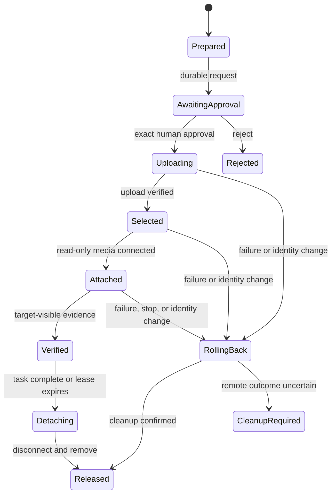

# Exact-byte content transfer

## Status

The target-free read-only media builder and approval-gated transaction
coordinator are implemented. No model-facing transfer tool exists and no
target has been contacted for this work. The daemon mutation bridge is
deliberately not exposed yet: it must require a one-time capability bound to
the exact browser-approved checkpoint before any PiKVM upload route can ship.

The current builder accepts in-memory bytes and safe guest filenames, enforces
32-file/16-MiB-per-file/64-MiB-total limits, writes a canonical SHA-256
manifest, invokes `genisoimage` with an exact argument vector, installs the
result mode `0600` without overwrite, and terminates the subprocess on
cancellation. Target-free extraction tests prove two source files and the
manifest are exact. Unsafe Windows names, case-insensitive collisions, budget
violations, and an existing output are refused before build.

The coordinator durably binds the private image receipt to a session, machine
fingerprint, control epoch, exact approval ID, and lease. It checkpoints before
upload/select/connect/disconnect/clear/remove, independently inspects after
each transition, rolls back a definitely failed mutation using only state
proven to belong to the transaction, and latches `cleanup_required` without a
retry after an ambiguous response. Rejection, target change, pre-upload lease
expiry, attached-media lease expiry, and emergency stop have target-free
contracts. Arbitrary VNC is refused before private staging.

Raw keyboard input is the wrong transport for a long script, document source,
or encoded file. The burst preflight now refuses those shapes, but a useful
product also needs a legitimate exact-byte path. For a physical PiKVM target,
the preferred adapter is read-only virtual media through the official Mass
Storage Drive API. An arbitrary VNC server does not provide an equivalent
capability.

## Product interface

The harness owns one deep module:

```text
stage_artifact(request) -> pending human approval
resolve_approval(exact approval id, decision)
status(transaction id) -> durable transaction state
release(transaction id) -> detached and removed, or cleanup required
```

The request contains:

- the selected machine identity and current control epoch;
- safe guest-visible filenames;
- byte lengths and SHA-256 digests;
- a content-addressed media name;
- a bounded attach lease;
- an explicit purpose visible to the operator.

It contains no daemon credentials. Model-facing MCP exposes neither staging nor
approval resolution.

## Transaction



The implementation must:

1. validate filenames, total bytes, file count, and duplicate names;
2. build read-only media containing the files and a canonical manifest;
3. independently re-hash both source files and the completed media image;
4. durably checkpoint the exact target, digests, media name, and approval ID;
5. require an exact browser-owned human approval for that checkpoint;
6. re-read machine identity, control epoch, and MSD state immediately before
   upload;
7. refuse a busy drive, connected media, insufficient storage, an existing
   media-name collision, or an MSD capability mismatch;
8. upload bytes directly, select the new image as CD-ROM/read-only, connect it,
   and re-read state after every transition;
9. show upload, select, attach, verification, lease, detach, remove, and cleanup
   uncertainty as durable UI events;
10. detach and remove on success, rejection after upload, emergency stop,
    identity change, timeout, or lease expiry;
11. latch `cleanup_required` rather than retrying or deleting blindly when a
    mutating response is ambiguous.

The official PiKVM API exposes state, upload, parameter selection,
connect/disconnect, remove, and reset operations under `/api/msd`. The
transaction uses those documented operations and never the remote-URL upload
route: content must not transit an arbitrary third-party host.

## Adapter capability

| Target adapter | Exact-byte staging | Product behavior |
| --- | --- | --- |
| Physical PiKVM with online MSD | Coordinator implemented; bridge gated | Approval-gated read-only virtual media after one-time daemon capability |
| PiKVM without MSD | Unsupported | Refuse before upload |
| Arbitrary VNC | Unsupported | Refuse; do not fall back to clipboard or HID encoding |
| Instrumented disposable lab | Lab-only option | Helper delivery may test orchestration but cannot count as production transfer evidence |

Linux and Windows can both consume read-only virtual media. Guest-side
automount behavior, drive-letter/mount-point discovery, and on-screen
verification remain OS-specific controller work.

## Evidence required before exposure

- one-time daemon capability that cannot be minted or reused by a model-facing
  client;
- daemon/PiKVM HTTP contract tests for every state transition and ambiguous
  failure;
- package/install validation for the optional `genisoimage` prerequisite;
- approval, target-identity, lease-expiry, stop, and cleanup-required tests;
- one isolated physical PiKVM trial on Windows and one on Linux;
- a public report with byte counts, end-to-end hashes, attach/detach latency,
  cleanup outcome, target capability, and failures in the denominator.

References:

- [PiKVM HTTP API: Mass Storage Drive](https://docs.pikvm.org/api/#mass-storage-drive)
- [PiKVM Mass Storage Drive handbook](https://docs.pikvm.org/msd/)
