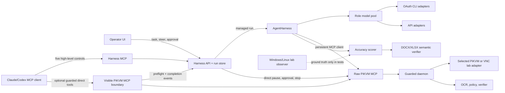

# Visible operator harness

## Why a separate harness exists

The raw PiKVM MCP server is a guarded transport, not a complete agent product.
Claude Code and Codex can call its burst tools directly, but then the outer
client owns planning, retries, screen interpretation, and the user experience.
The daemon's autonomous operator/router is bypassed.

The imported Claude conversation
`737f59a5-cba2-44aa-ad94-669b120c6403` makes the cost measurable:

| Signal | Observed |
|---|---:|
| total direct PiKVM calls | 551 |
| direct PiKVM bursts | 513 |
| explicit screenshots | 30 |
| session opens | 8 |
| typed characters | 70,968 |
| unverified `method=print` entries | 522 |
| base64-bearing entries | 141 |
| text entries over 120 characters | 285 |
| type-and-submit bursts | 345 |
| dangerous type-and-submit bursts | 20 |
| caller idempotency keys | 0 |

Run the privacy-preserving importer yourself:

```bash
pikvm-agent harness analyze-transcript /path/to/conversation.jsonl
```

The report stores typed-text lengths and hash prefixes, never the typed bodies.

## Product boundary



`AgentHarness` is the deep module. Its public interface is:

- `create(task, caller=None)` / `start(task)`
- `continue_run(run_id)`
- `pause(run_id)`
- `steer(run_id, instruction)`
- `status(run_id)`
- `resolve_approval(run_id, approval_id, decision)`
- `abort(run_id)`

The harness MCP exposes task creation, status, continue, pause, and abort. It
exposes neither raw click/type/burst tools nor approval resolution.
Generated launchers attach a validated, non-secret client label to task
creation. The API persists it as `caller.interface=managed_mcp`; the operator
console shows the originating Codex, Claude, Gemini, or OpenCode launcher while
the controller event separately names the provider/model that actually chose
the action. Each high-level call opens a fresh authenticated API connection.
An offline harness or rejected credential is reduced to a stable, non-secret
error that tells the outer client to remain in managed mode; the next call can
recover after restart without recreating the MCP process.
On POSIX, the managed facade and harness-owned raw child share one
descriptor-ready stdio module. It removes the SDK asynchronous-file worker
from the process seam while retaining the SDK's JSON-RPC validation and
session implementation; Windows continues through the SDK's native fallback.
Task creation is submit-once: the server supervises internal action slices,
verifier-more-work checkpoints, and safe replans until a meaningful stop.
`continue` exists for an operator-visible paused checkpoint, not as a clock
signal that the coding client must send after every few HID actions. Exact
human approval releases the remaining supervised task automatically.

Steering is a separate operator-only control. It cancels any in-flight provider
wait, durably records the guidance, invalidates the old plan, and optionally
resumes with a fresh reasoner request that includes the complete bounded
guidance history. It cannot be called with the coding-client agent credential,
cannot take authority from a `direct_mcp` or external-benchmark run, and refuses
to erase an unsettled pending action. That action must first settle or be
aborted so an ambiguous HID result is never re-planned into a duplicate.

Automatic progression is bounded separately from HID and provider budgets.
The supervisor releases the per-run lock between slices so Pause and Stop can
take authority immediately, refuses overlapping Continue calls, and records
every automatic resume. A ceiling stops a no-progress replan loop. After a
process restart, the supervisor reconstructs the consumed automatic-resume
budget from the complete durable event transcript. A restart therefore cannot
reset the ceiling, while a slice already authorized immediately before a crash
is still recovered exactly once. Only durable internal-yield checkpoints are
recovered; verification uncertainty, provider failure, model-budget
exhaustion, human pause, and approval waits remain stopped.

The ordinary PiKVM MCP is a second supported product mode. It is not an
unobserved escape hatch: public startup and protocol dispatch fail before a
tool body unless `PIKVM_HARNESS_OBSERVER_URL` and its token are configured.
With that boundary, its actual
`call_tool` boundary performs an authenticated harness preflight before the
tool body and reports completion afterward. These runs are labelled
`direct_mcp`; the UI shows the external caller/provider/model and never implies
that `AgentHarness` chose or independently verified the action.
The chat surface reinforces that boundary rather than relying on event
metadata alone: a direct trace is labelled `Guarded direct`, its managed model
route picker and chat composer are absent, and a visible
`New managed task` control creates a separate harness-owned run. Before a
direct pointer action, the observer captures and retains the exact pre-action
frame. The action row leads with a marked crop of that frame while keeping the
coordinate in Details, and the full frame is labelled `pre_action` rather than
being presented as independent verification.

For managed runs, every verifier call produces a labelled, full-resolution
before/after composite. The latest composite is checkpointed with the run and
served to the authenticated console as image bytes at
`/api/runs/{run_id}/verification-image`. Visible run JSON exposes only an
availability flag and revision; it excludes the server-side path. The browser
uses a revocable blob URL, so the bearer never appears in an image URL and old
evidence is released when the operator switches runs or closes the page.

For this mode, Pause gates subsequent direct calls; it cannot cancel an MCP
request already executing in a separate coding client. Stop is the active-call
control: it aborts the daemon session, releases HID, and latches the direct-run
gate. Every raw action-bearing MCP tool advertises
`destructiveHint=true` because its arguments can produce an external side
effect. This metadata lets a host apply its own conservative prompt policy, but
it never replaces the daemon's argument-, screen-, and freshness-aware approval
hold.

## Invariants

1. A reasoner makes a durable plan; a controller proposes one bounded burst; an
   independent verifier decides whether evidence is sufficient.
2. A pending action and its deterministic idempotency key are committed before
   any HID request.
3. An ambiguous transport failure leaves the pending action intact. Resume
   retries the same MCP request with the same key; it never asks a model to
   recreate the input.
4. Model fallback is allowed only before schema-valid output becomes an action.
5. Freshness versions come from the current observation and are attached by the
   harness, not trusted to model output.
6. The daemon remains the authoritative policy and execution boundary.
7. `needs_approval` exits the model loop. Only an exact human decision for the
   exact approval ID can resume it.
8. Success requires verifier evidence. Controller prose is never success.
9. Secret text is redacted in visible events.
10. There is no implicit computer target. `PIKVM_AGENT_DAEMON` must explicitly
    identify the selected isolated or production daemon.
11. Neither model-facing MCP surface exposes an approval tool. Only the
    browser-authenticated operator API can resolve the exact pending approval
    ID; its bearer is not forwarded to either model-facing MCP process.
12. Guarded direct mode fails closed before HID if visibility preflight is
    unavailable. Completion reporting is best-effort because failing a tool
    after HID has completed would encourage an unsafe retry.
    Degraded observe mode may fail open only for screenshots, OCR, abort, and
    panic-stop; every action/session-start tool remains fail-closed.
13. Public raw MCP startup requires both an explicit daemon and an operator
    visibility boundary; dispatch independently fails closed if startup is
    bypassed. The harness-owned private MCP child is the sole deliberate
    unobserved path because its calls are already represented by the managed
    run. The emergency brake requires an explicit daemon, daemon-confirmed HID
    quiescence, and returns the selected machine's safe identity.
14. Every actual provider invocation—including fallback and schema repair—is
    authorized and checkpointed against one durable run attempt budget before
    the provider is called. A resume cannot reset that accounting.
15. A metered run is enabled only by an explicit versioned customer price
    table. Each call reserves a configured upper bound before invocation;
    missing usage commits that reservation and stops. A response whose measured
    cost exceeds its reservation may exceed the cap by that one already-spent
    request, but no subsequent HID is accepted.
16. An Office acceptance task passes only when the managed run completes and
    the independently captured OOXML artifact satisfies the task contract.
    Screen-visible completion prose cannot substitute for saved-file proof.
17. Artifact acceptance is an observer-owned monotonic state machine. Neither
    the model/agent credential nor the browser operator credential can publish
    it, and a terminal pass or failure cannot be rewritten.
18. Provider-conformance evaluation is target-free and separately consented.
    It has no computer transport, retains call failures in its denominator,
    never overwrites an evidence file, and exposes only validated aggregates
    to the operator UI.
19. Raw HID text preflight rejects command-shaped dense encodings, encoded
    shell commands, heredoc openers, and long nested shell payloads before any
    adapter call. Contiguous type actions are classified as one payload so
    segmentation cannot bypass the gate. This is a refusal invariant, not a
    substitute transfer mechanism.
20. Operator steering is durable and forces a fresh reasoner plan, but cannot
    discard a pending action, resolve an approval, or change the owner of a
    direct or externally driven run.
21. A VNC lab adapter acquires one process-independent, canonical-target lease
    before opening RFB. A second local adapter fails before target contact, and
    neither the lease filename nor its contents persist the runtime endpoint.

The exact-byte replacement is specified in
[`CONTENT_TRANSFER.md`](CONTENT_TRANSFER.md). It is an approval-gated,
read-only PiKVM virtual-media transaction with durable attach/detach cleanup.
The target-free coordinator, exact operator approval, rollback, lease, stop,
and cleanup-required states are implemented and visible. The daemon mutation
bridge remains fail-closed until it can require a one-time capability bound to
that exact approved checkpoint. Arbitrary VNC deliberately reports the
capability as unsupported.

If every provider in a role route is temporarily unavailable, the run pauses
before HID and remains resumable. Provider errors exposed in health/events are
coarse classifications (authentication, rate limit, quota, timeout, provider
availability, or schema); arbitrary CLI stderr and HTTP response bodies are not
copied into the operator UI.

Provider eligibility is checked before each route boundary. Missing local
prerequisites are skipped without invoking the adapter. Runtime failures place
that provider on a configurable cooldown so every role boundary does not repeat
the same slow failure. When the cooldown expires it becomes eligible again; a
successful structured response clears its failure state. An executable or
credential environment variable is only a prerequisite, so the UI labels a
never-exercised route `Prerequisites present · unproven`.

## Provider model

Roles have independent ordered fallback chains:

- **reasoner** — slower, higher-reasoning model; creates/refreshes the plan.
- **controller** — fast multimodal model; emits one short action decision.
- **verifier** — independently judges the before/after screen and completion
  criteria.

Supported adapter families:

| Adapter | Authentication owner | Pixel input | Structured output |
|---|---|---:|---:|
| `codex_cli` | installed Codex CLI login | native `-i` | `--json` + `--output-schema` |
| `claude_cli` | installed Claude Code login | isolated `Read` artifact | native `--json-schema` |
| `gemini_cli` | dedicated Gemini CLI login | isolated `@` image artifact | CLI JSON framing + harness validation |
| `subprocess_json` | configured headless CLI/bridge | bridge-defined | harness validation |
| `openai_responses` | named server env var | native image input | Responses `text.format` JSON Schema |
| `azure_openai_responses` | API-key/token env or exact bearer command | native image input | Responses `text.format` JSON Schema |
| `openai_compatible` | named server env var | data URL | JSON Schema response format |
| `anthropic_api` | named server env var | base64 image block | `output_config.format` |
| `gemini_api` | named server env var | inline image data | `responseJsonSchema` |
| `vertex_gemini` | token env or exact bearer command | inline image data | `responseJsonSchema` |

The OAuth bridge never reads, copies, refreshes, or exports a CLI token. It
executes the vendor's supported headless command as an argument vector, never a
shell string. Codex runs are ephemeral and read-only in an empty temporary
workspace, with user config/rules/MCP disabled. A separate writable temporary
directory is passed as Codex's documented `sqlite_home`; it is outside the
model workspace while the CLI keeps ownership of authentication under
`CODEX_HOME`. Claude runs use safe/plan mode, no MCP or session persistence,
and only the built-in Read tool against a temporary directory containing the
current screen as its sole artifact.

Gemini CLI stores login and customization under the same profile root, so the
harness refuses to reuse an implicit interactive profile. `gemini_cli` requires
one named environment variable pointing to a dedicated profile created with
`GEMINI_CLI_HOME`. Each invocation overlays higher-precedence system settings
that empty the MCP catalogue/allow-list and disable skills, hooks, ambient
context, and directory-tree injection. It also supplies `--extensions none`
and a supplemental deny-all admin policy. Gemini CLI 0.35.3 deliberately
replaces file-based `admin.*` settings during its effective-settings merge, so
the adapter does not rely on those fields. The fresh workspace contains only
the copied screen and Gemini's `@` image preprocessing supplies the pixels.
Gemini CLI 0.35 provides JSON framing but no response-schema flag, so local
Pydantic validation and the existing bounded repair/failover lane remain
authoritative before HID.

The HTTP authentication seam is independent from the structured model
adapter. Azure OpenAI can therefore use an `api-key` environment variable, an
externally refreshed Entra bearer-token environment variable, or a fixed
no-shell credential command such as `az account get-access-token`. A credential
command receives empty stdin—never the task, screenshot, schema, or provider
response—inherits only named environment variables, has its own bounded
timeout, and must return one non-whitespace credential no larger than 16 KiB.
Only the resulting header reaches the HTTP client.

Vertex AI uses the same seam with the Gemini structured-output adapter. Its
configured base URL identifies the explicit project/location publisher
boundary, while either `gcloud auth print-access-token` or an externally
refreshed bearer-token environment owns authentication. The harness does not
read Application Default Credentials or copy the gcloud credential store.

`pikvm-agent harness check` verifies that every CLI executable and every named
API-key environment variable is present without reading or printing a
credential. For Gemini CLI it also verifies only that the named dedicated
profile directory exists; it never opens the OAuth token. Secret-bearing HTTP
headers are rejected from YAML.
`pikvm-agent harness support-bundle` performs a separate offline diagnostic:
it aliases provider names, omits model names and all endpoints/paths, reports
only credential presence/length/distinctness, inventories artifacts without
names, and hashes the configuration bytes without copying them. The mode-0600
JSON contains no run task, event, frame, provider output, or network probe,
refuses overwrite, and carries a canonical payload digest.
All API adapters share one HTTP lifecycle boundary. Connection diagnostics are
reduced to a coarse failure class there, before route fallback, health state,
or durable events can observe provider-controlled text.

The provider status endpoint and popover include adapter kind, authentication
owner, ordered role positions, configured/returned model string, API/CLI
interface, pixel-input shape, structured-output contract, prerequisite state,
calls, skips, consecutive failures, last latency, last success, cooldown, and
the latest blind-conformance exact/schema/latency result. The conformance
report itself can retain synthetic expected/observed values and normalized
usage for review; the health reader validates the complete schema and projects
only safe aggregates. A missing report is `not-run`, a provider omitted from a
valid report is `not-in-report`, and malformed evidence is `invalid-report`.
The model string is never resolved by guesswork: `account-default` and `opus`
remain visible aliases when the CLI does not identify its backend model.

Adapters preserve provider usage dictionaries on every structured response.
Public benchmark schema v4 stores first-pass and verifier usage per case and
sums top-level numeric fields by their vendor-reported names. Cost is derived
only when a separately versioned price table exists; the harness does not
invent prices or silently equate incompatible provider token fields.

The managed-run budget follows the same rule at execution time. Subscription
routes have zero metered settlement; metered routes declare a per-call
reservation plus exact usage-field paths and USD-per-million values. Provider
attempt, reservation, settlement, and fail-closed settlement events are
durable and visible. The support bundle reports only billing mode, whether a
cap is enabled, and the attempt limit; it omits price values and price-table
labels.

## Artifact-backed Office acceptance

[`bench/office-acceptance-v1.yaml`](../bench/office-acceptance-v1.yaml) defines
portable instructions using one `{artifact_path}` placeholder. The live runner
starts the normal visible managed harness, automatically requests only bounded
continuation slices, and waits when an approval appears. Its agent-scoped HTTP
client deliberately exposes no approval method.

After model completion, the lab observer reads the configured file and sends
its bytes through the existing screenshot-matrix oracle. Those MCP calls use
the guarded direct-call reporter, so they appear as a separate
`office-artifact-verifier` transaction rather than a hidden control path. The
host rejects malformed, encrypted, traversal-bearing, duplicate, oversized, or
entity-bearing OOXML before parsing:

- DOCX checks title, paragraph style/count, word bounds, exact paragraphs, and
  required phrases without copying document prose into public result JSON.
- XLSX resolves workbook relationships and shared/inline strings, then checks
  declared worksheet cells and formulas semantically.
- Public results retain task/spec identity, artifact SHA-256, pass/fail checks,
  provider/model lanes, wall/model/action efficiency, attempts, and configured
  cost accounting. The captured file itself is mode `0600`.

The managed run also exposes `pending`, `capturing`, and terminal artifact
acceptance in the operator transaction and event timeline. The observer-only
endpoint accepts no path, file content, task prose, or provider output. A pass
requires a completed run plus format, byte count, SHA-256, and all declared
semantic checks; terminal evidence is immutable. If the initial pending state
cannot be published, the Office coordinator aborts the managed run before
polling or continuing it.

For a disposable VM with the observer already installed,
`office-case --skip-provision` reuses
`C:/PiKVM-Harness/observer.exe` but does not reuse its process state. The
coordinator restarts the helper with the fresh per-attempt artifact path before
starting the lab. This prevents a stale or unknowable watched path from
silently defeating saved-file verification.

This is a ready acceptance path, not a live Office score. No supplied VNC
endpoint has been contacted by this implementation slice.

Provider configuration names environment variables; secrets stay outside YAML.
See [`config.harness.example.yaml`](../config.harness.example.yaml).

Relevant vendor contracts:

- [Codex non-interactive mode](https://learn.chatgpt.com/docs/non-interactive-mode)
  documents `codex exec`, JSONL, schemas, and reuse of saved CLI authentication.
- [Claude Code CLI reference](https://code.claude.com/docs/en/cli-usage)
  documents print mode, JSON output, permissions, and schema output.
- [Claude structured outputs](https://platform.claude.com/docs/en/build-with-claude/structured-outputs)
  documents `output_config.format`.
- [Gemini CLI headless mode](https://github.com/google-gemini/gemini-cli/blob/main/docs/cli/headless.md)
  documents JSON/JSONL output.
- [Gemini CLI FAQ](https://github.com/google-gemini/gemini-cli/blob/main/docs/resources/faq.md)
  documents account authentication behavior and usage limits.
- [Gemini generateContent](https://ai.google.dev/api/generate-content) documents
  multimodal parts and controlled JSON output.
- [Azure OpenAI Responses REST](https://learn.microsoft.com/en-us/rest/api/microsoft-foundry/azureopenai/responses)
  documents the `/openai/v1/responses` endpoint plus API-key and OAuth
  authentication.
- [Azure OpenAI Responses quickstart](https://learn.microsoft.com/en-us/azure/ai-foundry/openai/chatgpt-quickstart)
  documents API-key and Microsoft Entra token flows for the v1 endpoint.
- [Vertex AI Gemini quickstart](https://cloud.google.com/vertex-ai/generative-ai/docs/start/quickstart)
  documents the project/location publisher endpoint and gcloud bearer-token
  flow.
- [Vertex AI GenerationConfig](https://cloud.google.com/vertex-ai/generative-ai/docs/reference/rest/v1beta1/GenerationConfig)
  documents `responseMimeType` and `responseJsonSchema`.

## Visibility event contract

Every event has a stable sequence, UTC timestamp, kind, and structured data.
The server exposes bounded catch-up pages and a 200 ms server-sent event
stream. Stream readiness and five-second heartbeat messages make a silent
disconnect distinguishable from a quiet run; the browser reconnects from its
last cursor with bounded exponential backoff. The run rail never receives
event arrays. Run detail and the visible timeline retain only the latest 500
events while continuing to display the durable event count.

Durability has two separate shapes. Non-event run state remains one atomic JSON
checkpoint so the pending action and its idempotency key commit together before
HID. The run summary is event-free, and events are immutable rows keyed by
`(run_id, sequence)`. Saving a run validates the existing durable tail and
inserts only the new suffix. Old databases whose state JSON still contains an
event array are migrated transactionally on first open. UI inventory, state,
frame, catch-up, and SSE polling therefore do not deserialize full history.
The current provider/tool activity is a small durable run field rather than an
inference from the visible event tail. Its same-status start and end
transitions are emitted as `run.state`, so the activity chip and exact current
tool arguments remain accurate after more than 500 later events.
Managed continuations, pause/approval/abort mutations, and guarded direct-call
coordination load at most the latest 1,000 events plus the event-free state.
The snapshot carries its durable global cursor, so new events remain contiguous
without retaining or replaying the complete history. The model receives
trajectory signals from that bounded recent window. Explicit performance and
export reports may still scan the complete event table on demand.
Separately, the authenticated frame endpoint polls a read-only daemon preview.
Preview capture does not allocate a durable frame, advance world/control
versions, mark a model observation, or enter the MCP action queue. If that
source is unavailable, the endpoint fails visibly back to the last durable
checkpoint frame.

The preview adapter streams rather than eagerly buffers the daemon response,
rejects non-image media, invalid dimensions, empty bodies, and frames above
4 MiB, coalesces concurrent viewers of one session, and retains an eight-session
LRU backed by a fixed eight-stripe lock pool. The exact worst-case cached
payload is therefore 32 MiB, with a 450 ms minimum upstream capture interval.
This bounds the Python transport/cache; it does not yet measure browser decode
time or resident memory.

The UI can show, in real time:

- run creation and initial frame;
- configured target alias, hashed fingerprint, declared desktop layer, and
  whether human input occurred after the last controller observation;
- model role, candidate chain, chosen provider/model, latency, and usage;
- the checkpointed plan and completion criteria;
- controller intent and exact non-secret actions;
- the exact `pikvm_run_burst` arguments, freshness versions, action index,
  attempt, and idempotency key;
- transport ambiguity, stale-world refusal, and recovery;
- approval ID, risk, summary, and allowed decisions;
- verifier verdict, summary, and evidence;
- provider successes, failures, consecutive failures, and last latency;
- terminal completion, rejection, abort, block, or failure.

For direct MCP runs it instead shows the external client identity, its exact
non-secret tool arguments, daemon freshness/policy evidence, and operator
pause/approval/stop state. Secret-marked input remains executable in the local
durable record but is recursively redacted at every visible API boundary.
The post-call transaction retains completion/refusal status and measured
latency. Internal frame paths and the daemon's unbounded raw result object are
never serialized into run JSON; frames remain available through the
authenticated no-store endpoint.

Target identity is daemon-owned and provider-neutral. It is snapshotted when a
computer session opens, returned with observations, bound into direct approval
digests, and compared at both managed and direct-MCP harness boundaries. A
fingerprint mismatch is terminal for that run. The fingerprint hashes either
an explicit opaque id from the configured environment variable or the selected
endpoint; neither source value is returned. This proves configured-target
continuity, not physical hardware, foreground process, or nested guest
attestation.

Manual cursor reports and newly detected machine clients revoke the current
control epoch before HID. The runtime also checks for another client inside the
burst continuation gate so a mid-burst appearance interrupts the next bounded
micro-action.

This is structured telemetry, not a terminal-log wall. The event inspector can
still reveal the raw JSON for debugging.

## Operator UI information architecture

The primary workspace should keep the screen and the current transaction visible
at the same time:

1. **Run rail** — recent tasks, status, selected provider route, elapsed time.
2. **Live workspace** — current read-only preview, checkpoint
   frame/world/control versions, connection
   state, and a clear stale-frame indicator.
3. **Current transaction** — plan step, model role, intent, proposed actions,
   expected evidence, and verifier result.
4. **Timeline** — grouped model, MCP, policy, input, approval, and verification
   events; each group can expand to raw structured data.
5. **Approval shelf** — persistent, non-modal risk summary with approve, reject,
   and take-over. Approval shows the exact action and screen it was planned
   against.
6. **Provider strip** — live health, fallback, latency, and usage without
   overwhelming the task.
7. **Efficiency strip** — wall time, model-active time/calls, progress actions,
   harness-owned automatic continuations/stops, recoveries, and faults derived
   from durable run events.
8. **Replay/evals** — transcript imports and accuracy benchmark runs use the
   same event/timeline vocabulary.

Pause, continue, take over, and emergency stop stay reachable with the keyboard.
Pause and Stop cancel a running provider process before they acquire the run
lock. CLI subprocesses are killed on cancellation. A pending HID action remains
durable during Pause so an ambiguous call can only resume under the same
idempotency key; Stop clears it after aborting the daemon session.
The UI fetches frames and streams events with bearer authentication; an image
URL or EventSource query string never carries the token.

For exact code entry, OCR is evidence but not authority. A strong keyboard-layout
signature can select the single bounded correction path; small mixed OCR errors
remain ambiguous and stop the transaction without clearing or retyping the
field. The Windows observer supplies exact text only for its own benchmark
editor and exact bytes for an explicitly selected file. Its global hooks
deliberately report VK/scan events, not guessed layout/IME-dependent prose from
arbitrary applications. Office acceptance therefore uses saved DOCX/XLSX bytes
and semantic artifact checks as its exact oracle. In the disposable lab the
observer also supplies a source-side hashed guest fingerprint, Windows
session/input desktop, foreground process, focused-control class/id, and
foreground-membership proof. These fields are release evidence, not a
production dependency; helper-free nested desktops still need a bounded visual
identity contract.

## Security boundary

- The operator API requires a bearer token even on loopback.
- Operator, high-level agent, and direct-call observer credentials are
  separate. The agent credential is limited to non-approval run operations;
  the observer credential is limited to direct-call ingest and host artifact
  acceptance.
- The default server refuses non-loopback binds.
- Cross-origin requests are allowlisted.
- Approval additionally requires
  `X-PiKVM-Approval-Intent: <exact approval id>`.
- Neither model-facing MCP surface exposes an approval tool. Only the
  harness-owned private raw-MCP child exposes the destructive approval relay.
- `/api/health` reveals no sessions, providers, or machine state.
- The production machine is never a default. The VNC lab endpoint is supplied
  only to `pikvm-agent lab up --vnc ...`; it is not present in harness code or
  config.
- `lab up` preflights distinct scoped credentials and a usable provider route
  before opening VNC, supervises the adapter/daemon/operator UI together, and
  emits managed-only Claude/Gemini, Codex, and OpenCode client configs. Those
  clients receive neither a daemon URL nor raw HID tools.
- `harness client-audit` parses every explicitly supplied effective client
  scope and fails unless exactly one recognized managed PiKVM launcher exists.
  Raw, guarded-direct, duplicate, malformed, and unknown PiKVM launchers fail
  closed. Its report retains only anonymous scope labels, server names, and
  classifications; raw configuration and launch values never cross the audit
  interface.

For a hosted product, keep video, provider credentials, raw HID, and policy
execution in a local **edge worker**. A SaaS control plane should handle tenant
identity, encrypted command/event relay, fleet metadata, billing, and retained
audit summaries. Remote access requires authenticated TLS ingress, per-tenant
authorization, short-lived capabilities, and an explicit data-retention policy;
setting `allow_remote_bind` on a raw local process is not a deployment
architecture.

The staged hosted-product design and release gates are in
[`SAAS_PRODUCT.md`](SAAS_PRODUCT.md).

## Commands

```bash
pikvm-agent harness init --out config.harness.yaml

export PIKVM_AGENT_DAEMON=http://127.0.0.1:<selected-daemon-port>
export PIKVM_HARNESS_TOKEN="$(openssl rand -hex 32)"
export PIKVM_HARNESS_AGENT_TOKEN="$(openssl rand -hex 32)"
export PIKVM_HARNESS_OBSERVER_TOKEN="$(openssl rand -hex 32)"

pikvm-agent harness check --config config.harness.yaml
pikvm-agent harness serve --config config.harness.yaml
```

`harness init` detects supported logged-in Codex/Claude CLIs and can add native
OpenAI Responses, Azure OpenAI, Anthropic, Gemini AI Studio, Vertex AI, or
OpenAI-compatible API routes. Azure onboarding supports API-key, externally
refreshed Entra-token, and Azure-CLI-owned credential modes; Vertex supports
an externally refreshed token or gcloud-owned credential mode. It writes only
adapter settings, exact credential command arguments, and environment-variable
names; it never reads or persists a credential value. `--oauth-clis none`
supports API-only installs, and an empty provider selection is refused.

Generate a managed Claude Code/Codex configuration. Managed control is the
default:

```bash
pikvm-agent harness client-config \
  --config config.harness.yaml \
  --client codex
```

`--client claude`, `--client gemini`, and `--client opencode` emit those
clients' native local-MCP shapes. All four generated managed launchers contain
only the scoped agent-token environment-variable name.

Audit the merged effective client configuration before launching it:

```bash
pikvm-agent harness client-audit \
  --client codex \
  --native-inventory \
  --project . \
  --out /tmp/codex-client-audit.json
```

The Codex path asks the CLI for its resolved JSON inventory and does not launch
the configured MCP servers. It runs with empty stdin, a ten-second timeout, a
1 MiB output ceiling, exact argument vector, and only `HOME`, `PATH`, and
optional `CODEX_HOME`. Raw stdout/stderr never enters the report. This follows
Codex's documented shared user/trusted-project MCP configuration model:
<https://learn.chatgpt.com/docs/extend/mcp#connect-codex-to-an-mcp-server>.

For Claude, include its user/local state plus project `.mcp.json`; for Gemini
and OpenCode, include every effective file scope. The parser understands Codex
TOML/native inventory, shared MCP JSON, Claude/Gemini JSON, and legacy plus V2
OpenCode JSON/JSONC. It exits nonzero for a missing, competing, duplicated, or
ambiguous managed boundary and writes an optional mode-`0600`, no-overwrite,
secret-free report. Explicit documents are supplied from lowest to highest
precedence: a later same-named server replaces the earlier definition, while
different PiKVM names coexist and fail. Codex currently has native
effective-inventory enumeration; the other clients cannot be proven isolated
if a scope is omitted.

For the installed stable clients, launch without mutating persisted MCP state:

```bash
pikvm-agent harness client-launch \
  --client codex \
  --config config.harness.yaml \
  --project .

pikvm-agent harness client-launch \
  --client codex \
  --config config.harness.yaml \
  --project . \
  --execute
```

The dry-run and execution paths share one deep module and the same preflight.
Codex injects a session-only override for the managed `pikvm` launcher and asks
the native CLI for its exact merged inventory before starting; unrelated MCP
servers remain available, while any differently named raw/direct PiKVM entry
fails closed. Claude uses its native `--mcp-config` plus
`--strict-mcp-config` interface after a bounded capability probe confirms both
flags. Normal client authentication remains client-owned. The managed MCP child
still receives only the agent-token environment-variable name. No persisted
client registration is written or removed. OpenCode uses native `--pure`,
isolated writable state, an inline config, and `debug config` as its resolved
inventory. The resolved document must contain exact default-deny permissions
with only the selected managed MCP wildcard allowed; its client-owned OAuth
file is linked into the ephemeral state without reading or copying it. Gemini
requires a dedicated profile and clean workspace. Its installed native
effective-settings loader must resolve exactly one system-defined,
system-allowlisted managed MCP server. The launcher also configures
`--extensions none` and a supplemental default-deny policy whose only allow
rule is the managed MCP server. The current empty-profile audit verifies the
resolved settings plus exact policy path/content, but has not executed a model,
extension, tool, or policy decision; that enforcement remains an acceptance
gate.

The same module owns non-interactive acceptance. `harness client-task` reads
the task from stdin, so task prose never appears in the client argument vector
or launch audit. Codex adds `exec --json --ephemeral --sandbox read-only`;
Claude adds `--print --output-format stream-json --no-session-persistence
--permission-mode dontAsk`; Gemini adds `--prompt "" --output-format
stream-json --approval-mode default`, its MCP allow-list and extension
selection; OpenCode adds `--pure run --format json`. No route enables a
permission-bypass flag. The post-run summary contains only task byte
count/digest, exit code, elapsed time, and the safe isolation summary.

`harness smoke-lab` is the target-free adoption seam. It builds the production
`AgentHarness`, model pool, operator API/UI and, in normal CLI construction,
SQLite store around explicitly labelled deterministic computer/model adapters.
It exposes client identity, model lanes, exact redacted action, checkpoint
frame, labelled comparison, and terminal verification. It opens no VNC, PiKVM,
daemon, or external model connection. The deterministic adapters make this a
launch and visibility contract, not an accuracy score.

Exercise those exact generated commands without a computer target or external
provider before installing them into a client:

```bash
pikvm-agent harness client-acceptance \
  --out /tmp/managed-client-acceptance.json
```

The deterministic synthetic loop checks the five-tool inventory, scoped child
environment, managed task completion, operator/API visibility, durable SQLite
recovery after harness restart, and safe outage errors. It emits a mode-`0600`
no-overwrite report with startup, task, and recovery latency for every selected
client, and exits nonzero if any client fails.

Or retain direct model control while making every tool call visible and
operator-gated:

```bash
pikvm-agent harness client-config \
  --config config.harness.yaml \
  --client codex \
  --control-mode direct

PIKVM_MCP_PROVIDER=openai-oauth \
PIKVM_MCP_MODEL=<actual-model-string> \
  pikvm-agent harness direct-mcp \
  --config config.harness.yaml \
  --mode guarded \
  --caller-label codex-cli
```

The emergency brake is deliberately independent of the model and operator web
process:

```bash
PIKVM_AGENT_DAEMON=http://127.0.0.1:<selected-daemon-port> \
  pikvm-agent panic-stop
```

If the daemon selection is absent, startup is refused before any network
request. A non-quiesced response is failure, not a successful stop report.
