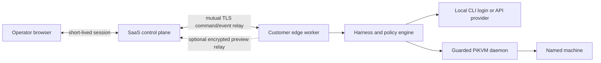

# Hosted product shape

## Product promise

Give an operator one place to see what an AI-controlled computer sees, what it
plans to do, the exact guarded input it is attempting, the evidence returned,
and the decision that currently belongs to a human. Provider choice must not
change machine safety or the audit shape.

The first sellable product is local-first. A customer runs an edge worker next
to its PiKVM or approved VNC test machine and opens the operator console on its
own network. The hosted control plane comes later; it must not turn raw HID,
provider credentials, or customer screens into centrally held ambient access.

## System boundary

The edge worker owns:

- raw video capture and HID execution;
- model-provider credentials and CLI authentication;
- action checkpoints and idempotency keys;
- policy evaluation and approval enforcement;
- emergency-stop execution;
- unredacted short-retention artifacts.

The control plane owns:

- tenant identity, membership, roles, and SSO;
- registered edge workers and machine aliases;
- signed task/approval capabilities;
- encrypted command and event relay;
- fleet policy metadata, quotas, billing, and retained redacted audit summaries.

Screen relay is off by default for high-security tenants. When enabled, it is
end-to-end encrypted to an authorized operator session, has an explicit
retention setting, and is not used for analytics or model training.

## Tenant model

The durable product entities are:

- **Tenant** — billing and isolation boundary.
- **Member** — viewer, operator, approver, or administrator.
- **Edge worker** — customer-owned execution identity with a revocable
  certificate.
- **Machine** — a human-readable alias bound locally to one transport target.
  The control plane never needs the raw VNC/PiKVM address.
- **Provider connection** — local credential reference plus centrally visible
  readiness/health metadata.
- **Policy set** — versioned risk rules and approval requirements.
- **Run** — task, plan, state, budgets, event cursor, and outcome.
- **Artifact proof** — task-spec digest, captured-file digest, semantic checks,
  capture error, and the provider/action performance record used for the
  acceptance decision.
- **Action transaction** — intent, redacted arguments, freshness,
  idempotency key, attempts, and verification.
- **Approval** — exact action digest, frame/world/control version, risk,
  approver identity, decision, and timestamp.

Every record is tenant-keyed. Authorization checks bind tenant, edge, machine,
run, action digest, and capability expiry; knowing a run ID is never authority.

## Control protocol

The control plane sends signed, expiring commands such as create, pause,
continue, abort, and resolve-approval. The edge returns monotonically sequenced
events using the existing harness vocabulary. Reconnect uses an acknowledged
cursor, making delivery at-least-once while action execution remains
effectively-once through the edge-owned idempotency ledger.

Approval capabilities are single-use and bind:

- tenant, member, role, run, and approval ID;
- the proposed action digest;
- machine world version and control epoch;
- allowed decision and expiry.

An expired, replayed, cross-run, or stale approval fails closed at the edge.

## Security and privacy gates

No hosted release is acceptable without:

1. mutual TLS edge enrollment, rotation, and revocation;
2. tenant-scoped envelope encryption with separate data-encryption keys;
3. append-only, tamper-evident action and approval records;
4. explicit frame, trace, and transcript retention controls;
5. content redaction before events leave the edge;
6. rate, concurrency, action, and spend budgets enforced at the edge;
7. tested operator pause and emergency stop that do not depend on model health;
8. regional data placement and documented subprocess/network egress;
9. audit export and tenant deletion workflows;
10. external penetration testing of relay, tenancy, approval replay, and edge
    update paths.

Provider tokens are never uploaded. A hosted OAuth integration may issue its
own provider grant only where the provider explicitly supports that use; it
must not scrape or proxy a coding CLI's cached session.

## Release sequence

### 1. Local operator edition

Ship the current harness as a signed package with guided edge configuration,
the live console, provider checks, the redacted offline support bundle,
transcript import, the VNC accuracy lab, and the checked wheel-acceptance
contract. Provider attempts and customer-versioned metered prices are reserved
and settled locally before HID; the hosted control plane receives only the
chosen accounting/event export.
Exit gate: repeated text, code, clicking, OCR, retry, approval, Word, and Excel
benchmarks pass on Windows and Linux test VMs; saved Office artifacts are
independently verified; and no machine address appears in source or generated
harness config.

### 2. Team edge edition

Add local users/roles, machine aliases, policy profiles, audit export, and an
updater. Exit gate: two-person approval can be enforced locally and a
disconnected edge remains safe and operable.

### 3. Hosted fleet preview

Add tenant identity, edge enrollment, encrypted event relay, fleet inventory,
and optional zero-retention screen relay. Exit gate: cross-tenant tests,
revocation, relay replay, regional retention, and emergency-stop drills pass.

### 4. Hosted general availability

Add SSO/SCIM, enterprise policy distribution, compliance exports, quotas,
billing, regional workers, support tooling, and an externally reviewed threat
model. Exit gate: every safety-critical control has a machine-independent
integration test and an incident runbook.

## Commercial packaging

- **Developer** — one edge, a small machine limit, local console, transcript
  replay, and community support.
- **Team** — shared runs, approver roles, policy profiles, retained audit
  history, and managed updates.
- **Enterprise** — SSO/SCIM, regional control plane, private relay, custom
  retention, audit export, fleet policy, and support SLAs.

Meter control-plane services and retained data, not individual HID events. A
customer should be able to run the safety-critical edge loop during a hosted
outage and export its own evidence.
